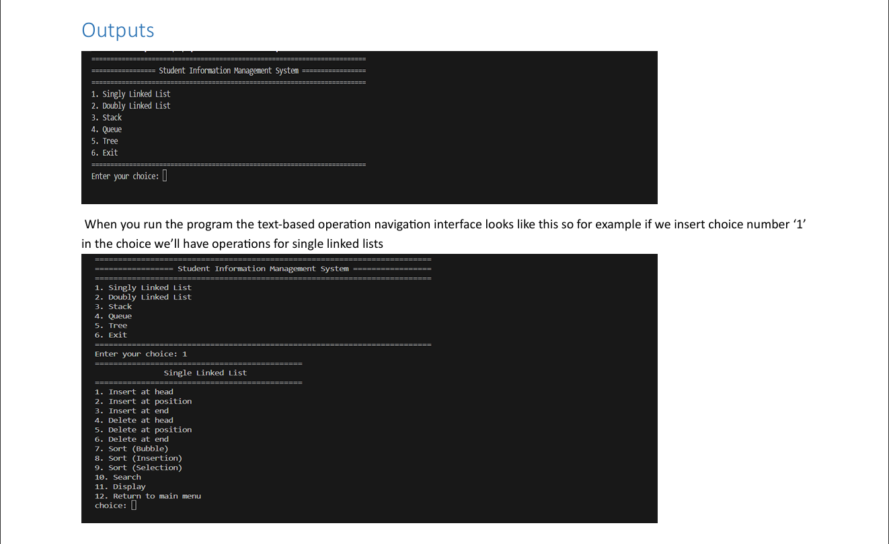
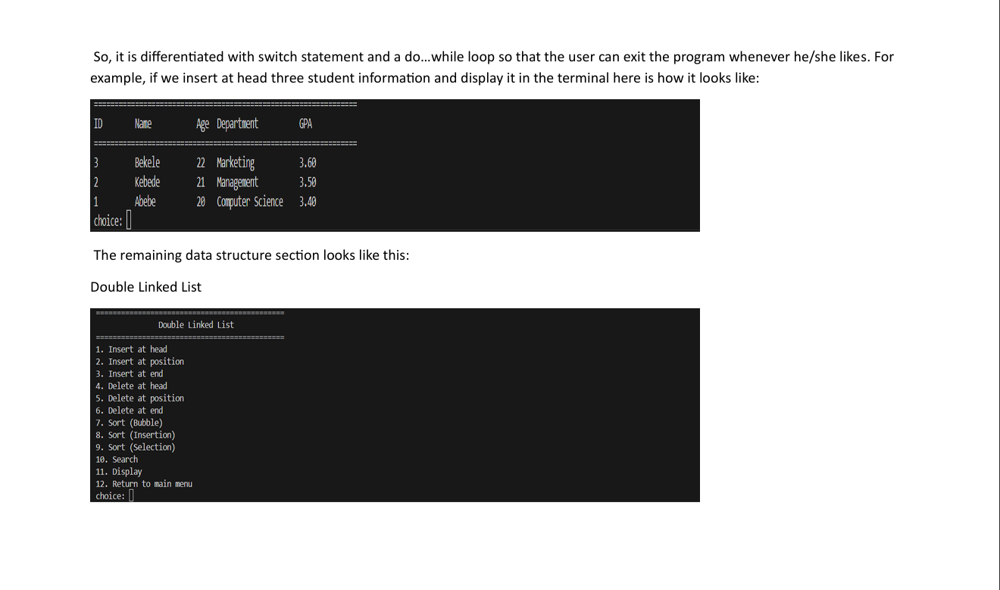
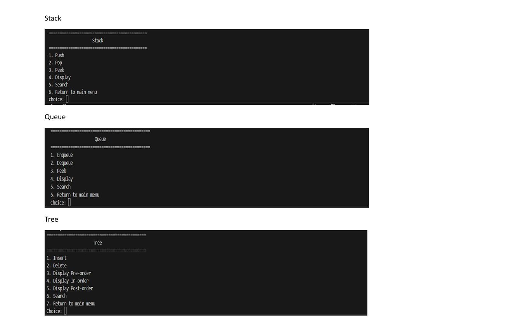

# DSAStudentInformation

This project is a C++ implementation of core data structures applied to a Student Information Management System.
It was developed as part of a Data Structures and Algorithms (DSA) course assignment to demonstrate CRUD operations and traversal techniques using linked lists, stacks, queues, and trees.

# Features
Student Information Management
Add, delete, search, and display student records.

# Data Structures Implemented
    - Singly Linked List
    - Doubly Linked List
    - Stack (push, pop, peek)
    - Queue (enqueue, dequeue)
    - Binary Tree (insert, delete, traversals)

# Operations
    - Insertion
    - Deletion
    - Traversal/Display
    - Search
    - Sorting (multiple methods)

# Technologies Used
    - Language: C++
    - Compiler: g++ (GNU Compiler Collection)
    - IDE: Any C++ IDE (Visual Studio Code)

## Clone the repository:
git clone https://github.com/ab2160/DSAStudentInformation.git
cd DSAStudentInformation
# Project Structure
DSAStudentInformation/
├── src/
│   ├── StudentInformationManagement.cpp          # Student entity implementation
├── README.md

    
